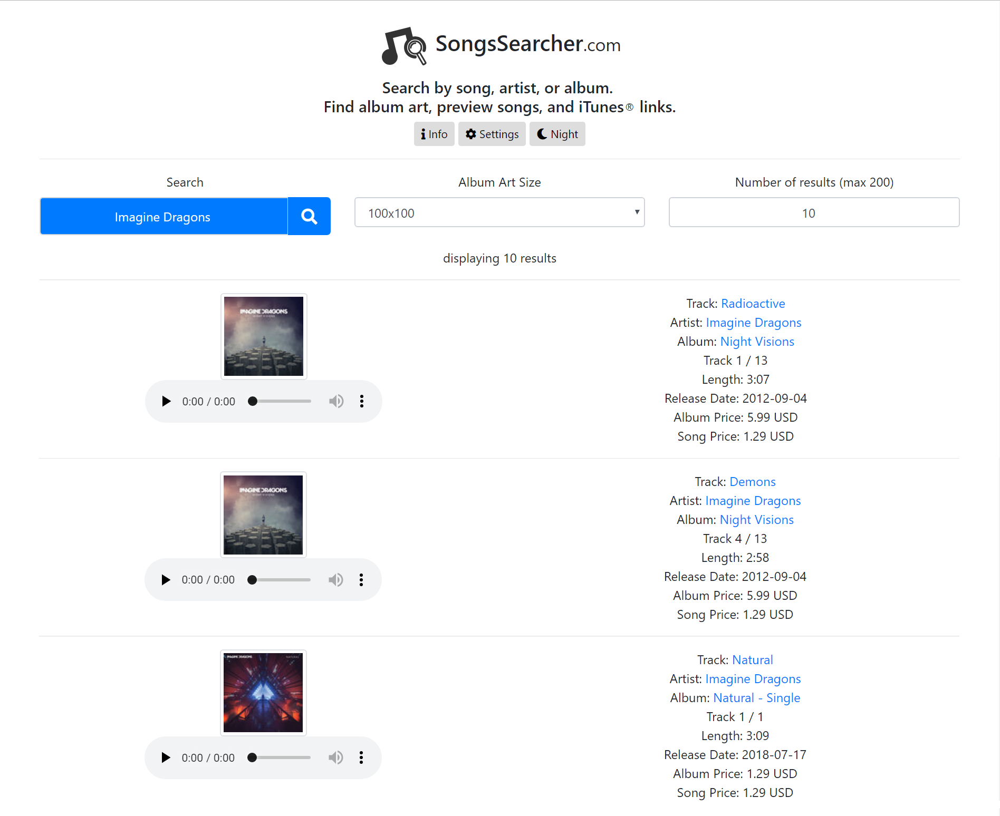

# SongsSearcher 

<a href="https://songssearcher.com">songssearcher.com</a>

🎵 Search by song, artist, or album. 

🔍 Quickly grab album art, preview songs, and more.

<i>Find information quickly and efficiently about songs, artists, or albums. Includes previews of songs, high quality album art, and more</i>

## ❓ How to use

Enter the name of a song, artist, or album.

Choose the size of album art and how many results (maximum 200) to display.

Get data on the top results in the country of your choice.

Click on the album art to get the highest quality available album art (up to 3000x3000px).

View song, artist, and album names with links to all three on iTunes®.

View more track info, including cost in local currency, release date, and length.

Listen to a preview of the songs.

## ⚙ Options / Features

- Night mode

- Select country to search from

- Checkboxes to choose which to display among

  - Album art

  - Song preview

  - Song info

- Zoom in feature for accessibility

- Back to top button

- Copy the link to your search

- Print, refresh, and fullscreen buttons

- A beautiful lgoo that animates when you search

- Links to Youtube, lyrics, and BPM

## 😊 Uses

Quickly grab album art, to update your song metadata.

Use album art as a new wallpaper for your phone, tablet, or computer.

Show your friends (or remind yourself) how a song goes.

Discover new songs by a specific artist.

Get links to iTunes® for a song, artist, or album.

Quickly find the length of a song or its release date.

## 😭 Known Problems

- On older versions of mobile Safari, the user interface is jumbled

- Some countries listed don't return data

## ℹ️ About

Data from the iTunes® API

Powered by Bootstrap, jQuery, FontAwesome, ShareThis, Google Analytics, and of course, Github Pages

✉ Email us at <a href="mailto:contact@songssearcher.com">contact@songssearcher.com</a> for questions, comments, or concerns

😃 Developed by <a href="https://justingolden21.github.io">Justin Golden</a>

✉ Want to talk with me? Email me at <a href="mailto:justingolden@rgbstudios.org">justingolden@rgbstudios.org</a>

💸 Donate via PayPal at <a href="https://www.paypal.me/RGBStudios">paypal.me/RGBStudios</a>
